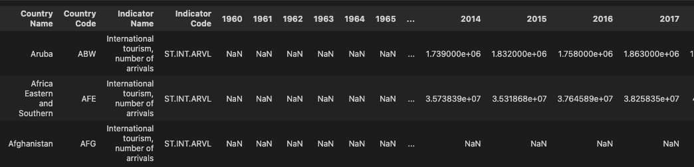
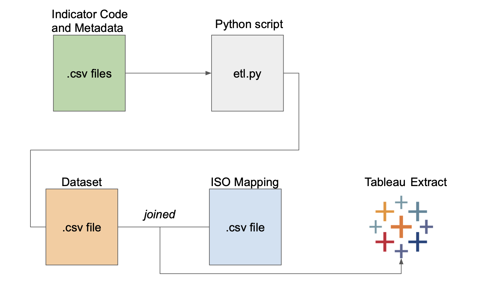
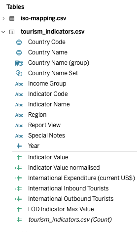
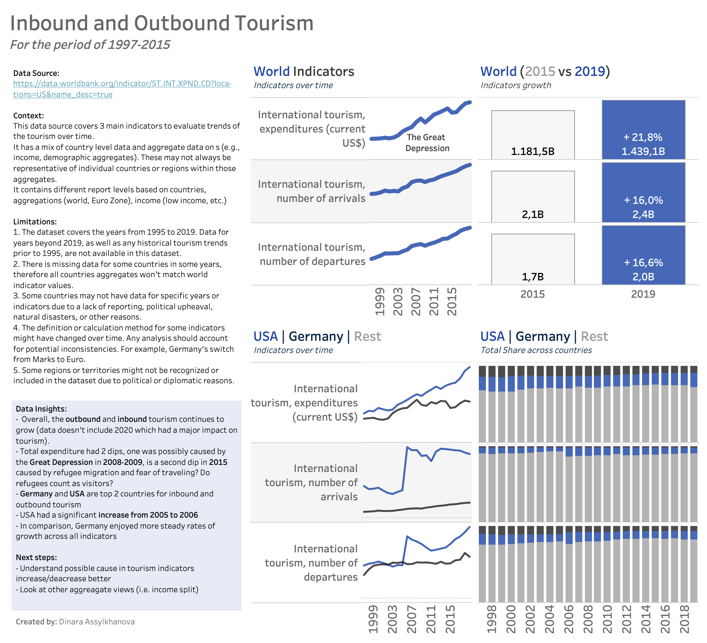

# Tourism Data Analysis

An small ETL pipeline and analysis  that covers various aspects of global tourism such as inbound, outbound number of visitors and touism expenditure.

## Table of Contents

1. [Data Source](#data-source)
2. [ETL Pipeline](#etl-pipeline)
3. [Data Cube Design](#data-cube-design)
4. [Visualizations and Findings](#visualizations-and-findings)
5. [Running the Project](#running-the-project)
6. [Future Enhancements](#future-enhancements)
7. [License](#license)

## Data Source

**Source**:  
These datasets were obtained from [World Bank](https://data.worldbank.org/indicator/ST.INT.XPND.CD?locations=US&name_desc=true) but initially seen on [Kaggle](https://www.kaggle.com/datasets/ayushggarg/international-tourism-demographics).

**Limitations**:
- The dataset covers the years from 1995 to 2019. Data for years beyond 2019, as well as any historical tourism trends prior to 1995, are not available in this dataset.
- There may be missing values for specific indicators or years, which could impact any analysis conducted.
- Some countries may not have data for specific years or indicators due to a lack of reporting, political upheaval, natural disasters, or other reasons.
- The dataset contains aggregate values (e.g., income, demographic aggregates). These may not always be representative of individual countries or regions within those aggregates.
- All data is sourced from the World Bank, which means it is reliant on the reporting standards and accuracy of this institution. Any inherent biases or errors in World Bank reporting will be reflected in the dataset.
- The definition or calculation method for some indicators might have changed over time. Any analysis should account for potential inconsistencies.
- Some regions or territories might not be recognized or included in the dataset due to political or diplomatic reasons.
- The dataset may not capture specific economic or cultural nuances that impact tourism. For instance, a country might have seen a spike in tourism due to a global event (like the Olympics) which may not be immediately evident from the data.
- The dataset predominantly focuses on tourism-related metrics. It may not have other potentially relevant data, such as geopolitical events, climate data, or global economic trends, which could also influence tourism.
- The dataset is at a country/year level of granularity. Finer details, such as monthly or city-specific tourism data, are not available.
Currency and Inflation: Any financial data might not account for inflation or currency fluctuations, which could impact the real-world interpretation of the values.

**Files**: 

Main files:
- `data/input/main/arvl.csv`:

   

- `data/input/main/dprt.csv`: Another data file and its details.
- `data/input/main/xpnd.csv`: 

Meta files:

Country descriptions

- `data/input/meta/metadata_country_arvl.csv`: Metadata based Country Code for International inbound tourists
- `data/input/meta/metadata_country_dprt.csv`: Metadata based Country Code for International outbound tourists
- `data/input/meta/metadata_country_xpnd.csv`: Metadata based Country Code for International expenditure

Indicator descriptions

- `data/input/meta/metadata_indicator_avrl.csv`: International inbound tourists (overnight visitors) are the number of tourists who travel to a country other than that in which they have their usual residence, but outside their usual environment, for a period not exceeding 12 months and whose main purpose in visiting is other than an activity remunerated from within the country visited. When data on number of tourists are not available, the number of visitors, which includes tourists, same-day visitors, cruise passengers, and crew members, is shown instead. Sources and collection methods for arrivals differ across countries. In some cases data are from border statistics (police, immigration, and the like) and supplemented by border surveys. In other cases data are from tourism accommodation establishments. For some countries number of arrivals is limited to arrivals by air and for others to arrivals staying in hotels. Some countries include arrivals of nationals residing abroad while others do not. Caution should thus be used in comparing arrivals across countries. The data on inbound tourists refer to the number of arrivals, not to the number of people traveling. Thus a person who makes several trips to a country during a given period is counted each time as a new arrival.

- `data/input/meta/metadata_indicator_dprt.csv`: International outbound tourists are the number of departures that people make from their country of usual residence to any other country for any purpose other than a remunerated activity in the country visited. The data on outbound tourists refer to the number of departures, not to the number of people traveling. Thus a person who makes several trips from a country during a given period is counted each time as a new departure.

- `data/input/meta/metadata_indicator_xpnd.csv`: International tourism expenditures are expenditures of international outbound visitors in other countries, including payments to foreign carriers for international transport. These expenditures may include those by residents traveling abroad as same-day visitors, except in cases where these are important enough to justify separate classification. For some countries they do not include expenditures for passenger transport items. Data are in current U.S. dollars.

ISO mapping:

- `data/input/iso_mapping.csv`

## ETL Pipeline

### Data Flow

1. **Extraction**: Data was extracted from the provided CSV files.
2. **Transformation**:
   - Data cleansing was performed to handle missing values, duplicates, and outliers.
   - Data from different sources was merged based on common identifiers like 'Country Code'.
   - The merged data was then reshaped and transformed to prepare it for analysis. The report level was added based on custom mapping.
3. **Loading**: The cleaned and transformed data was exported as a csv file for further analysis in Tableau. It was mapped with iso mapping directly in Tableau Workbook using native joins.

### Data Cleansing

- Missing Values: Approach taken to handle missing values (e.g., imputation, deletion).
- Duplicates: Details on how duplicates were identified and handled.
- Outliers: Approach for outlier detection and management.

### Transformations

1. Merged data based on 'Country Code'.
2. Reshaped the data using the `melt` function for easier analysis.
3. Mapped country names to ISO codes for standardized representation.
4. Renamed fields suitable for SQL Database ingestion.
5. Created `report_view` field to break down dataset with different aggregation levels.

### Lookups

ISO mapping was sourced from [GitHub](https://github.com/lukes/ISO-3166-Countries-with-Regional-Codes/blob/master/all/all.csv).

## Visualizations and Findings

Insights were generated using Tableau Desktop.
Unfortunately, uploading to Tableau Public didn't work out.

All Indicators were normalised within the workbook.

**Key Findings**:

Overall, the outbound and inbound tourism continues to grow (data doesn't include 2020 which had a major impact on tourism).

- Total expenditure had 2 dips, one was possibly caused by the Great Depression in 2008-2009, is a second dip in 2015 caused by refugee migration and fear of traveling? Do refugees count as visitors?
- Germany and USA are top 2 countries for inbound and outbound tourism
- USA had a significant increase from 2005 to 2006
- In comparison, Germany enjoyed more steady rates of growth across all indicators

**Next steps**:
**For ETL**:
- Include more tests
- Remove duplicates, outliers

**For Analysis**:
- Understand possible cause in tourism indicators increase/deacrease better
- Look at other aggreagate views (i.e. income split)

## Running the Project

**Prerequisites**: 
- Python 3.x
- Libraries: pandas, matplotlib, ...

**Steps**:
1. Clone the repository: `git clone REPO_URL`.
2. Navigate to the project directory: `cd DIRECTORY_NAME`.
3. Install necessary libraries: `pip install -r requirements.txt`.
4. Run the main ETL script: `python etl.py`.

## Future Enhancements

- Integration with a data visualization tool for more interactive insights.
- Expand the dataset to include more years/indicators.
- Automate the ETL process for real-time data updates.

## License

This project is licensed under the MIT License - see the [LICENSE.md](LICENSE.md) file for details.
